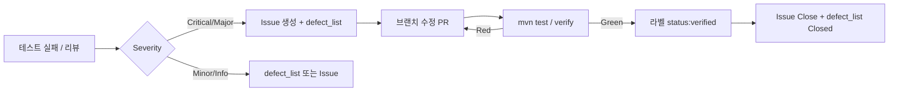

# 결함관리 보고서 Prompting

## 사용 프롬프트

### 1. 결함 관리 문서 작성 프롬프트

```text
@defect_list.md @requirements_analysis.md @test_plan.md

[P] QA 리드 엔지니어입니다.
[T] 결함 관리 문서를 defect_report.md로 작성해줘.
    1) 결함 분류 체계:
       Severity (Critical/Major/Minor/Info) x ItemType (5종) 매트릭스 표
    2) 결함 보고서 템플릿 (재현/기대/실제/원인/수정/검증)
    3) 품질 메트릭 수집 계획
       - 테스트 통과율, 커버리지, 단계별 결함 발견율
       - C++: gcov/lcov / Java: JaCoCo / Python: pytest-cov
    4) (선택) GitHub Issues 연동 워크플로우
[F] Markdown. defect_report.md로 저장
```

### 2. 보고서 내보내기 프롬프트

```text
이번에 한 내용을 report 폴더에 09_결함관리_보고서.md 파일로 내보내주고, 
프롬프트를 포함해서 Prompting 폴더에 09_결함관리_보고서-Prompting.md 파일로 내보내줘
```

## 산출물

- `docs/defect_report.md`: 결함 관리 원본 문서
- `report/09_결함관리_보고서.md`: 보고서 제출본
- `Prompting/09_결함관리_보고서-Prompting.md`: 프롬프트와 산출물 기록

---

# Gilded Rose 결함 관리 보고서

## 1. 목적과 범위

본 문서는 Gilded Rose `updateQuality()` 도메인 로직에 대한 **결함 분류**, **보고서 작성 표준**, **품질 메트릭 수집 계획**을 정의한다. 기준 문서는 다음과 같다.

| 문서 | 역할 |
| --- | --- |
| [requirements_analysis.md](../docs/requirements_analysis.md) | 아이템 유형별 비즈니스 규칙·경계값·시나리오 |
| [test_plan.md](../docs/test_plan.md) | 테스트 우선순위(P0~P2), 경계값 매트릭스, JaCoCo 목표 |
| `defect_list.md` | 개별 결함 ID·상태·담당 추적 목록(운영 시 갱신) |

본 프로젝트의 기본 스택은 **Java + Maven + JUnit 5**이며, 다언어 포크(C++/Python)가 있을 경우 동일 분류 체계를 공유한다.

## 2. 결함 분류 체계

### 2.1 Severity 정의

| Severity | 정의 | 대표 영향 | 대응 SLA(권장) |
| --- | --- | --- | --- |
| **Critical** | 핵심 규칙 전면 오류, 빌드/테스트 전체 실패, 데이터 무결성 파괴(음수 `quality` 등) | 전 아이템·전 시나리오 | 즉시 수정, 배포 차단 |
| **Major** | 특정 아이템 유형 또는 만료/경계 규칙이 요구사항과 불일치 | 해당 유형 사용자 결과 오류 | 현재 스프린트 내 수정 |
| **Minor** | 제한된 입력·조합에서만 발생, 우회 가능 | 일부 경계·조합 | 백로그, 회귀 테스트 추가 후 수정 |
| **Info** | 기능 영향 없음, 문서/테스트 갭, 관측·개선 제안 | 품질 가시성 | 기록만, 선택적 개선 |

### 2.2 ItemType 정의 (5종)

| ItemType | 식별 기준 | 핵심 불변식 |
| --- | --- | --- |
| **Normal** | 특수 이름이 아닌 일반 아이템 | `sellIn` -1/일, 만료 전 `quality` -1·만료 후 -2, `0 ≤ quality ≤ 50` |
| **Aged Brie** | `Aged Brie` | 증가형, 만료 후 2배 증가, 상한 50 |
| **Backstage Pass** | `Backstage passes to a TAFKAL80ETC concert` | `sellIn` 구간별 1/2/3 증가, 콘서트 후 `quality = 0` |
| **Sulfuras** | `Sulfuras, Hand of Ragnaros` | `sellIn`·`quality` 불변, `quality = 80` 예외 |
| **Conjured** | 이름에 `Conjured` 포함 | 만료 전 `quality` -2, 만료 후 -4, 하한 0 |

### 2.3 Severity × ItemType 매트릭스

셀 내용: **대표 결함 유형** / **예시 ID(defect_list 용)** / **검증 우선 테스트**

| Severity \ ItemType | Normal | Aged Brie | Backstage Pass | Sulfuras | Conjured |
| --- | --- | --- | --- | --- | --- |
| **Critical** | 모든 아이템에 동일 감소 적용, `quality` 음수 허용 / DEF-N-CRIT-01 / P0 불변식 | 증가 대신 감소, 상한 미적용으로 50 초과 / DEF-AB-CRIT-01 / P0 | 콘서트 후에도 `quality` 유지 / DEF-BS-CRIT-01 / P0 | `sellIn` 또는 `quality` 변경 / DEF-SU-CRIT-01 / P0 | Conjured 미구현(Normal 분기 처리) / DEF-CJ-CRIT-01 / P0 |
| **Major** | 만료 후 1회만 감소(2배 미적용), `sellIn` 0 보정 / DEF-N-MAJ-01 / P0·경계 `sellIn=0` | 만료 후 1 증가만 적용 / DEF-AB-MAJ-01 / P0 | `sellIn=11`에서 2 증가, `sellIn=0`에서 0 미처리 / DEF-BS-MAJ-01 / P1 전환점 | `quality`를 50으로 클램프 / DEF-SU-MAJ-01 / P0 | 만료 전 -1만 적용(2배 미적용) / DEF-CJ-MAJ-01 / P0 |
| **Minor** | `sellIn` 음수를 0으로 보정 / DEF-N-MIN-01 / P1 | `quality=49`에서 50 초과 / DEF-AB-MIN-01 / P1 | `quality=49`+`sellIn=5`에서 50 초과 / DEF-BS-MIN-01 / P1 | 음수 `sellIn`에서만 오동작 / DEF-SU-MIN-01 / P1 | `quality=3`, `sellIn>0`에서 1만 감소 / DEF-CJ-MIN-01 / P1 |
| **Info** | 테스트·요구사항 매핑 누락 / DEF-N-INFO-01 / 문서 | 동일 / DEF-AB-INFO-01 | Golden Master 미갱신 / DEF-BS-INFO-01 | 상한 50 예외 미문서화 / DEF-SU-INFO-01 | 신규 요구 테스트 Green, 회귀만 부족 / DEF-CJ-INFO-01 |

**분류 규칙**

1. 한 결함은 **가장 높은 Severity** 하나만 부여한다.
2. ItemType은 **직접 영향을 받는 유형**을 기록하고, 혼합 배열 결함은 Primary + `Affected: all`로 표기한다.
3. `test_plan.md` P0 실패는 최소 **Major**, 요구사항 불변식 위반은 **Critical**로 승격한다.
4. `mvn test` Green이나 요구사항 매핑·커버리지 갭만 있으면 **Info**로 기록한다.

## 3. 결함 보고서 템플릿

각 결함은 `defect_list.md`에 한 행으로 요약하고, 상세는 아래 템플릿을 복제해 기록한다.

````markdown
## [DEF-XX-YYY-NN] 제목 (한 줄)

| 필드 | 내용 |
| --- | --- |
| ID | DEF-XX-YYY-NN |
| Severity | Critical / Major / Minor / Info |
| ItemType | Normal / Aged Brie / Backstage Pass / Sulfuras / Conjured |
| 상태 | Open / In Progress / Fixed / Verified / Closed |
| 발견 단계 | 단위 / 경계값 / Golden Master / 회귀 / CI |
| 관련 요구사항 | requirements_analysis.md §N 또는 시나리오 번호 |
| 관련 테스트 | `GildedRoseTest#methodName` 또는 Golden Master |
| 담당 | |
| 발견일 | YYYY-MM-DD |

### 재현 (Reproduction)

1. 전제: `Item` 초기 상태 (`name`, `sellIn`, `quality`)
2. 실행: `new GildedRose(items).updateQuality()` (또는 N일 반복)
3. 관측: 실패 테스트명·Surefire 로그·스냅샷 diff

**최소 재현 입력 예시**

```java
Item[] items = { new Item("Conjured Mana Cake", 3, 6) };
new GildedRose(items).updateQuality();
// 관측: items[0].sellIn, items[0].quality
```

### 기대 (Expected)

- 요구사항·테스트 계획에 따른 `sellIn`, `quality` (수치 명시)
- 예: `sellIn=2`, `quality=4` (Conjured, 만료 전 2 감소)

### 실제 (Actual)

- 관측된 `sellIn`, `quality` 또는 예외·빌드 메시지
- Surefire: `expected: <X> but was: <Y>`

### 원인 (Root Cause)

- 코드 위치: 파일·메서드·분기 (예: `GildedRose.updateItem` — Conjured 미분기)
- 근본 원인: 규칙 누락 / 경계 조건 오류 / 순서 오류(`sellIn` 감소 시점) 등

### 수정 (Fix)

- 변경 파일·요약 (`Item` 클래스는 수정 금지)
- 최소 diff 원칙, 리팩터링은 별도 작업으로 분리

### 검증 (Verification)

- [ ] `mvn clean test` — Failures: 0
- [ ] 실패했던 테스트 케이스 통과
- [ ] 동일 ItemType 경계값(P1) 회귀 없음
- [ ] (해당 시) `mvn clean verify` — JaCoCo 기준 충족
- [ ] defect_list.md 상태 → Verified → Closed
````

### 3.1 작성 예시 (Major · Conjured)

| 섹션 | 내용 |
| --- | --- |
| ID | DEF-CJ-MAJ-01 |
| 재현 | `Conjured Mana Cake`, `sellIn=3`, `quality=6` → 1회 `updateQuality()` |
| 기대 | `sellIn=2`, `quality=4` |
| 실제 | `sellIn=2`, `quality=5` (Normal -1만 적용) |
| 원인 | `isConjured()` 분기 없이 Normal 감소 로직 사용 |
| 수정 | `isConjured` 분기 및 `decreaseQuality(item, sellIn<=0 ? 4 : 2)` |
| 검증 | `GildedRoseConjuredTest` P0 전체 Green |

## 4. 품질 메트릭 수집 계획

### 4.1 수집 메트릭 정의

| 메트릭 | 정의 | 목표(본 프로젝트) | 수집 주기 |
| --- | --- | --- | --- |
| **테스트 통과율** | `(통과 테스트 수) / (실행 테스트 수) × 100` | 100% (`Failures=0`, `Errors=0`) | 커밋·PR·야간 CI |
| **라인 커버리지** | 실행된 라인 / 전체 라인 | ≥ 90% (`GildedRose` 핵심 로직 ≥ 95%) | `mvn verify` |
| **브랜치 커버리지** | 실행된 분기 / 전체 분기 | ≥ 90% (1단계 85% 허용) | `mvn verify` |
| **단계별 결함 발견율** | 해당 단계에서 **신규 Open** 결함 수 / 해당 단계에서 실행·검토한 테스트(또는 케이스) 수 | 추세 모니터링(절대값보다 단계 이동) | 스프린트·마일스톤 |

**단계별 결함 발견율 — 테스트 단계 매핑**

| 단계 | 활동 | 결함 발견 특성 |
| --- | --- | --- |
| **T1 단위(P0)** | 아이템 유형별 핵심 규칙 | Critical/Major 다수, 구현 누락 |
| **T2 경계값(P1)** | `quality` 0,1,49,50 / `sellIn` 0,-1, Backstage 전환점 | Major/Minor |
| **T3 Golden Master** | 30일 시뮬레이션·ApprovalTests | 통합·순서·누적 오류 |
| **T4 회귀·리팩터링** | 구조 변경 후 전체 스위트 | 재발 결함 |
| **T5 CI 게이트** | `verify` + JaCoCo check | Info(커버리지 갭), 빌드 차단 |

**발견율 계산 예**

```text
T1 결함 발견율 = (T1에서 Open 등록된 결함 수) / (T1에서 추가·실행한 테스트 메서드 수)
```

### 4.2 언어별 커버리지 도구

| 언어 | 도구 | 수집 명령(예) | 리포트 위치 |
| --- | --- | --- | --- |
| **Java (본 저장소)** | **JaCoCo** (`jacoco-maven-plugin`) | `mvn clean verify` | `target/site/jacoco/index.html` |
| **C++** | **gcov** + **lcov** + (선택) genhtml | `g++ --coverage` → 테스트 실행 → `lcov --capture` | `coverage.info` → HTML |
| **Python** | **pytest-cov** | `pytest --cov=src --cov-report=html` | `htmlcov/index.html` |

#### Java — JaCoCo (권장 `pom.xml` 스니펫)

```xml
<plugin>
  <groupId>org.jacoco</groupId>
  <artifactId>jacoco-maven-plugin</artifactId>
  <version>0.8.12</version>
  <executions>
    <execution>
      <id>prepare-agent</id>
      <goals><goal>prepare-agent</goal></goals>
    </execution>
    <execution>
      <id>report</id>
      <phase>verify</phase>
      <goals><goal>report</goal></goals>
    </execution>
    <execution>
      <id>check</id>
      <phase>verify</phase>
      <goals><goal>check</goal></goals>
      <configuration>
        <rules>
          <rule>
            <element>BUNDLE</element>
            <limits>
              <limit>
                <counter>LINE</counter>
                <value>COVEREDRATIO</value>
                <minimum>0.90</minimum>
              </limit>
              <limit>
                <counter>BRANCH</counter>
                <value>COVEREDRATIO</value>
                <minimum>0.90</minimum>
              </limit>
            </limits>
          </rule>
        </rules>
      </configuration>
    </execution>
  </executions>
</plugin>
```

#### C++ — gcov / lcov

```bash
g++ -std=c++17 --coverage -o gilded_rose_tests tests/*.cpp src/*.cpp
./gilded_rose_tests
lcov --directory . --capture --output-file coverage.info
lcov --remove coverage.info '/usr/*' --output-file coverage.info
genhtml coverage.info --output-directory coverage_html
```

#### Python — pytest-cov

```bash
pytest --cov=gilded_rose --cov-branch --cov-report=term-missing --cov-report=html
```

### 4.3 메트릭 대시보드·기록 양식

| 주차 | 테스트 통과율 | 라인 % | 브랜치 % | T1 | T2 | T3 | T4 | T5 | Open Critical | Open Major |
| --- | --- | --- | --- | --- | --- | --- | --- | --- | --- | --- |
| W20 | 100% (34/34) | — | — | 0 | 0 | 0 | 0 | 0 | 0 | 0 |

> JaCoCo 미도입 기간에는 커버리지 셀을 `—`로 두고, P0 시나리오 매핑률(요구사항 시나리오 27개 중 테스트 연결 수)을 보조 메트릭으로 사용한다.

### 4.4 수집 절차 (로컬·CI 공통)

1. `mvn clean test` → Surefire XML/`Tests run`에서 **통과율** 산출.
2. (JaCoCo 적용 후) `mvn clean verify` → `jacoco.xml` 또는 HTML에서 **라인/브랜치** 추출.
3. 실패 테스트 → §3 템플릿으로 결함 등록 → Severity×ItemType 분류.
4. `defect_list.md`에 ID·상태 갱신, 발견 단계(T1~T5) 기록.
5. 수정 후 §3 검증 체크리스트 완료 시 메트릭 행 갱신.

## 5. (선택) GitHub Issues 연동 워크플로우

### 5.1 이슈 라벨 체계

| 라벨 | 용도 |
| --- | --- |
| `defect` | 기능 결함 (기본) |
| `severity:critical` / `major` / `minor` / `info` | Severity |
| `item:normal` / `aged-brie` / `backstage` / `sulfuras` / `conjured` | ItemType |
| `phase:T1-unit` … `phase:T5-ci` | 발견 단계 |
| `status:verified` | 수정·테스트 완료, Close 전 |

### 5.2 워크플로우



### 5.3 Issue 템플릿 요약

```yaml
name: Defect Report
labels: ["defect"]
body:
  - type: dropdown
    id: severity
    attributes:
      label: Severity
      options: [Critical, Major, Minor, Info]
  - type: dropdown
    id: item_type
    attributes:
      label: ItemType
      options: [Normal, Aged Brie, Backstage Pass, Sulfuras, Conjured]
  - type: textarea
    id: reproduction
    attributes:
      label: 재현
  - type: textarea
    id: expected
    attributes:
      label: 기대
  - type: textarea
    id: actual
    attributes:
      label: 실제
```

## 6. defect_list.md 연동 규칙

`defect_list.md`는 본 문서의 **운영 인덱스**이다. 최소 컬럼:

| ID | Severity | ItemType | 상태 | 발견 단계 | 요약 | Issue |
| --- | --- | --- | --- | --- | --- | --- |
| DEF-CJ-MAJ-01 | Major | Conjured | Closed | T1 | 만료 전 2 감소 | #12 |

- 신규 결함: §3 템플릿 작성 → 목록 한 행 추가.
- 현재 저장소 기준: [06_테스트_실행_결함_분석_보고서](../report/06_테스트_실행_결함_분석_보고서.md)에 따라 **Open 결함 0**, 전체 Severity 스냅샷 **Info**(테스트 Green, 추적 대상 없음).

## 7. 참고 명령

```bash
# 테스트 통과율
mvn clean test

# 커버리지(JaCoCo plugin 적용 후)
mvn clean verify
# 리포트: target/site/jacoco/index.html
```

## 8. 문서 이력

| 버전 | 일자 | 변경 |
| --- | --- | --- |
| 1.0 | 2026-05-19 | 초안: 분류 매트릭스, 보고서 템플릿, 메트릭 계획, GitHub 연동 |
